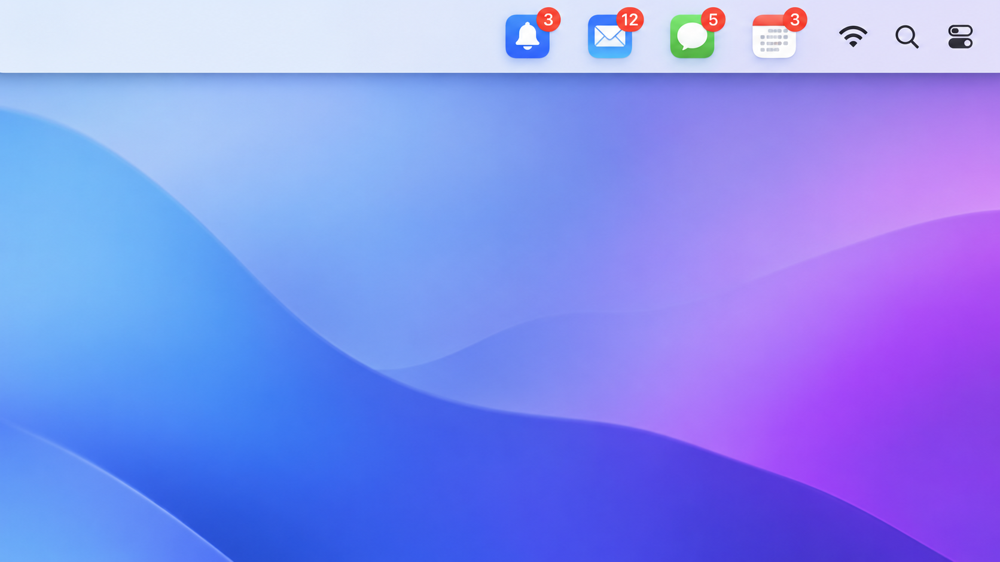

# BadgeBar



Mirror app **unread badges** (Mail, Slack, Microsoft Teams, …) into the macOS
**menu bar**, so you never miss a message while working full-screen or on a
second display where the Dock isn't visible.

A modern, Apple-Silicon-native rewrite of the idea behind
[Doll](https://github.com/xiaogdgenuine/Doll) — built with current SwiftUI,
the Observation framework, and Swift Concurrency, targeting macOS 14+.

## How it works

macOS apps don't expose their unread count through any public API. The only
reliable way to read it is from the **Dock**: apps render the count onto their
Dock tile, and the Dock exposes it via the Accessibility API as the tile's
`AXStatusLabel` attribute.

BadgeBar walks the Dock's accessibility tree once per second and copies the
badge of each monitored app into its own menu-bar status item. (Accessibility
can't notify on attribute changes, so a 1-second poll is used — it costs well
under a millisecond.)

This means **you must grant BadgeBar the Accessibility permission**
(System Settings → Privacy & Security → Accessibility), otherwise nothing can
be read.

## Install

### Homebrew

```sh
brew install --cask ahmetrende/tap/badgebar
```

Then open it once via right-click → **Open** (see step 3 below), and grant
Accessibility permission.

### Manual (DMG)

1. Download `BadgeBar.dmg` from the [latest release](../../releases/latest).
2. Open it and drag **BadgeBar** into **Applications**.
3. **First launch:** because the app isn't notarized by Apple, double-clicking
   shows a security warning. **Right-click the app → Open → Open** (you only
   need to do this once). Alternatively, run:
   ```sh
   xattr -dr com.apple.quarantine /Applications/BadgeBar.app
   ```
4. Grant **Accessibility** permission when prompted (required to read badges).

Requires macOS 14 (Sonoma) or later, Apple Silicon or Intel.

## Build & run (no Xcode required)

Only the Swift toolchain from Command Line Tools is needed.

```sh
./run.sh          # build release, sign, (re)launch
# or
./build.sh        # just build BadgeBar.app
open BadgeBar.app
```

`build.sh` compiles the package, assembles `BadgeBar.app`, and code-signs it.
Run `./setup-signing.sh` once to create a stable self-signed identity — then
the Accessibility grant survives rebuilds. Without it, `build.sh` falls back to
ad-hoc signing. The package also opens directly in Xcode (open `Package.swift`).

> Note: with ad-hoc signing (i.e. before running `setup-signing.sh`), macOS may
> ask you to re-grant the Accessibility permission after each rebuild, because
> the binary's signature changes.

## Usage

1. Launch the app — it lives only in the menu bar (no Dock icon).
2. On first run the picker opens. Search for an app and click **Add**.
3. Grant Accessibility permission when prompted.
4. The app's icon appears in the menu bar; its badge (the same count the Dock
   shows) updates every second.
   - **Left-click** an icon → show the app, or hide it if it's already frontmost (toggle).
   - **Right-click** (or **⌥-click**) → menu (Configure…, Stop monitoring, Quit).

When nothing is monitored — or when you enable *Always show a BadgeBar icon* —
a small bell icon stays in the menu bar for access (left-click opens Settings,
right-click for Configure/Quit). If Accessibility access is missing, a warning
icon appears there instead; click it to grant access.

### Settings

The configuration window has two tabs:

- **Apps** — search installed apps to add/remove them, and **drag the monitored
  list to reorder** how icons appear in the menu bar.
- **Settings**:
  - **Menu bar**
    - *Show unread count* — off shows a small red dot instead of the number.
    - *Only show an app when it has a notification* — hides the icon until
      there's an unread badge.
    - *Dim the icon when there's no notification* — greys it out instead of
      hiding.
    - *Hide an app when it isn't running* — removes the icon while closed.
    - *Always show a BadgeBar icon* — keep a permanent menu-bar entry.
  - **On-screen alert** — a floating alert that appears briefly on top of
    everything (including full-screen apps) when a new message arrives.
    Toggle on/off and choose how long it stays (2 / 4 / 6 s). Click it to open
    the app.
  - **General** — *Launch at login* (via `SMAppService`), a *Poll interval*
    (1 / 2 / 5 s) to trade latency for fewer wakeups, and *Check for Updates…*.
  - **Permissions** — Accessibility status with a deep-link to System Settings.
    If access is revoked while running, a warning icon appears in the menu bar.

**Per-app overrides:** right-click an app's menu-bar icon → *This app* to
override *Show unread count* or the floating alert just for that app.

The UI is localized (English / Turkish, following your system language).

## Performance

BadgeBar runs in the background all day, so each 1 Hz poll is kept as cheap as
possible:

- **Cached Dock tiles.** Each monitored app's Dock tile `AXUIElement` is cached,
  so a normal poll costs just one attribute read per app — not a full
  Accessibility tree walk. A walk happens only when a tile goes stale (app
  quit, Dock restarted), and is backed off to ~every few seconds for apps that
  have no tile at all.
- **No redundant drawing.** A menu-bar icon is re-rendered only when its badge
  (or a display setting) actually changes — not 86 400 times a day.
- **Event-driven running state.** "Hide when not running" uses a set kept up to
  date by workspace launch/quit notifications, instead of enumerating every
  process each second.
- **No-op writes skipped** and the **settings window is torn down on close**, so
  the installed-apps list and its Spotlight query don't linger in memory while
  idle.

Measured idle cost (3 monitored apps, Apple Silicon): ~**0.3 % of a single
core** and ~**11 MB** of private (dirty) memory.

## App icon

`generate-icon.swift` draws the icon (a bell + red badge) programmatically and
exports an `.iconset`. To regenerate:

```sh
swift generate-icon.swift
iconutil -c icns AppIcon.iconset -o AppIcon.icns
```

`build.sh` copies `AppIcon.icns` into the app bundle automatically.

## Packaging a release

```sh
./make-dmg.sh     # builds the app and produces BadgeBar.dmg
```

Upload the resulting `BadgeBar.dmg` to a GitHub Release. The build is
self-signed (not notarized), so users open it once via right-click → Open
(see [Install](#install)). If you later enroll in the Apple Developer Program
($99/yr), you can sign with a Developer ID and notarize for a friction-free
install.

## Project layout

```
Package.swift                  SwiftPM manifest (macOS 14+, Swift language mode 5)
Info.plist                     Bundle metadata (LSUIElement agent app)
build.sh / run.sh              CLI build + sign + launch
make-dmg.sh                    Package BadgeBar.dmg for distribution
setup-signing.sh               One-time stable self-signed identity (dev)
generate-icon.swift            Generates the app icon
Sources/BadgeBar/
  main.swift                   NSApplication bootstrap (.accessory)
  AppDelegate.swift            Wires the model, monitor, status bar, window
  Models.swift                 MonitoredApp + AppStore (@Observable, persisted)
  Settings.swift               UserDefaults-backed display settings
  Accessibility.swift          AX permission check/prompt
  BadgeReader.swift            Reads AXStatusLabel from the Dock (cached tiles)
  BadgeMonitor.swift           1 Hz poll loop + new-message detection
  RunningApps.swift            Event-driven running-app set
  InstalledApps.swift          Spotlight-based app discovery
  StatusItemController.swift   One NSStatusItem per app + click handling
  AppLauncher.swift            Open / toggle / activate apps
  BadgeIcon.swift              Renders icon + red badge for the menu bar
  AlertPresenter.swift         Floating on-screen alert on new messages
  SettingsView.swift           SwiftUI settings window
```

## Contributing

Issues and pull requests are welcome. To hack on it: clone, run `./run.sh`, and
edit. No Xcode required to build the app (though `Package.swift` opens in Xcode
too).

Unit tests cover the pure logic (badge-change detection, version comparison,
model persistence). Run them with `swift test` — this needs XCTest, which ships
with Xcode, so it runs in CI (GitHub Actions, `.github/workflows/ci.yml`) even
if your local machine only has the Command Line Tools.

## License

[MIT](./LICENSE) © 2026 Ahmet Rende. In the spirit of the original
[Doll](https://github.com/xiaogdgenuine/Doll) — use, modify, and redistribute
freely.
